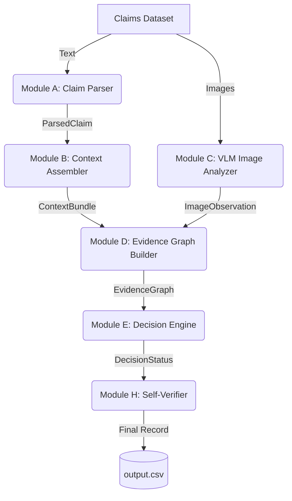

# HackerRank Orchestrate: Damage Claim Verification Pipeline

Welcome to the **HackerRank Orchestrate** challenge submission for multi-modal damage claim verification. This repository contains an automated, scalable pipeline designed to ingest noisy user claims, extract canonical evidence intents, and verify them against visual evidence requirements using a deterministic Evidence Graph.

## Project Overview

Modern insurance and return-merchandise operations are bogged down by manual visual reviews. The goal of this project is to build an intelligent, multi-modal pipeline capable of analyzing conversational customer claims, cross-referencing them against user history and evidence requirements, and rendering deterministic adjudication decisions (Accept, Reject, Manual Review).

## Problem Statement

Claim processing involves reading messy, multilingual transcripts (e.g., Hinglish) and extracting structured data (claim object, specific parts, damage types). These claims must then be matched against specific regulatory requirements and evaluated for visual evidence using images. The challenge is mitigating AI hallucination while maintaining high throughput.

## Architecture

Our solution adopts a strictly pipelined architecture, separating the probabilistic LLM/VLM extraction steps from the deterministic reasoning layers.



### Multi-Agent Pipeline

1. **Claim Parser**: Ingests raw dialogue, applies reverse-chronological extraction, resolves multi-lingual negation, and deduplicates canonical parts.
2. **Context Assembler**: Hydrates the claim with user history (risk flags) and fetches specific `evidence_requirements` for the VLM step.
3. **Image Analyzer (VLM Probe)**: A decoupled vision model that strictly extracts visual facts (visible parts, visible damage, image quality) without rendering judgments.
4. **Decision Engine**: Reads the deterministic graph edges to assign statuses.
5. **Self-Verifier**: A strict post-processing guardrail that asserts the final decision is logically backed by the Evidence Graph topology, forcing `manual_review_required` on failure.

### Evidence Graph Reasoning

Instead of asking a VLM to "approve or reject" a claim (which leads to hallucination), we build an Evidence Graph. 

Nodes consist of the Claim, Parts, Issues, and Images. Edges are drawn (e.g., `SUPPORTS`, `CONTRADICTS`, `INSUFFICIENT`). The Decision Engine evaluates the entire graph deterministically. If an image actively `CONTRADICTS` the claim, it's rejected. If the graph lacks sufficient `SUPPORTS` edges, it requests manual review.

## Evaluation Strategy

We employ a custom, framework-independent evaluation suite (`evaluation/evaluate.py`) that computes accuracy, precision, recall, and F1-scores without relying on external libraries like `scikit-learn` (ensuring environmental consistency).

Additionally, `evaluation/error_analysis.py` categorizes pipeline failures into five distinct buckets (Damage Detection, Part Detection, Severity, Evidence Sufficiency, Risk Flags) and outputs a detailed Markdown report (`error_report.md`) to guide iteration.

## Setup Instructions

1. Ensure Python 3.9+ is installed.
2. Clone this repository.
3. Install dependencies:
```bash
pip install -r requirements.txt
```

## Running Predictions

To run the pipeline and generate `output.csv`:

```bash
python run.py
```

## Running Evaluation

To calculate F1-scores and view error analysis:

```bash
python evaluation/evaluate.py --preds output.csv --truth dataset/sample_claims.csv
python evaluation/error_analysis.py --preds output.csv --truth dataset/sample_claims.csv
```

## Project Structure

```text
├── code/
│   ├── pipeline/
│   │   ├── adjudicator.py          # Legacy rule engine (deprecated by Decision Engine)
│   │   ├── claim_parser.py         # Module A
│   │   ├── context_assembler.py    # Module B
│   │   ├── decision_engine.py      # Module E (Graph-based Adjudicator)
│   │   ├── evidence_graph.py       # Module D
│   │   ├── evidence_retriever.py   # Context Dependency
│   │   ├── image_analyzer.py       # Module C
│   │   ├── risk_analyzer.py        # Context Dependency
│   │   └── self_verifier.py        # Module H (Guardrails)
├── dataset/                        # Input datasets
├── docs/                           # Internal Architecture documentation
├── evaluation/                     # Metric logic
│   ├── evaluate.py
│   └── error_analysis.py
├── run.py                          # Main Orchestrator
├── requirements.txt
└── README.md
```
