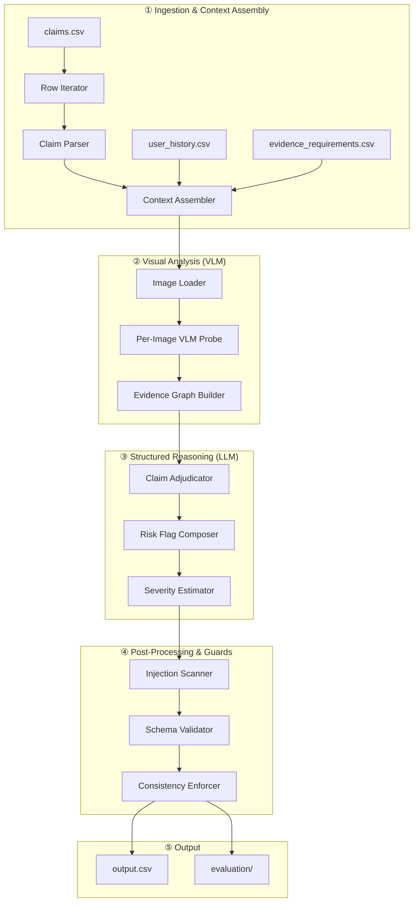
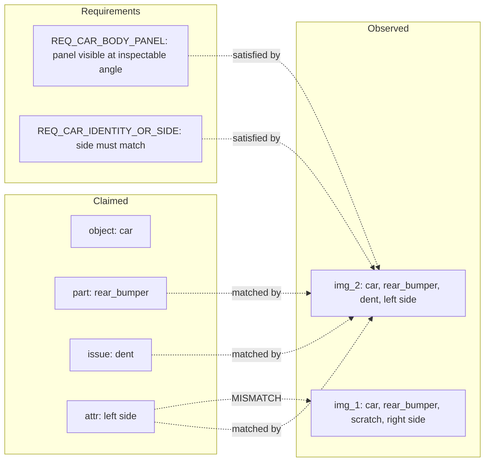
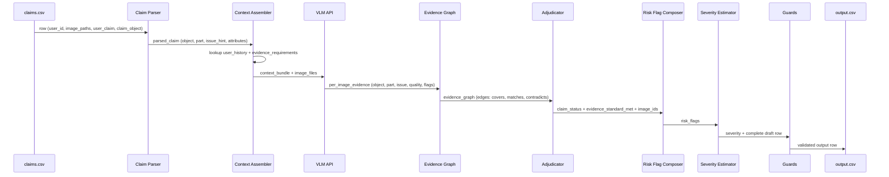
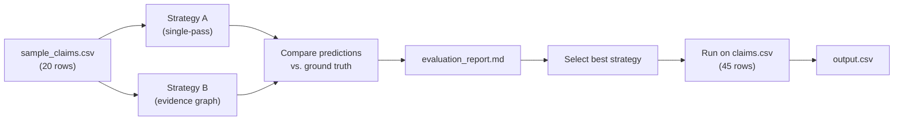

# System Design — Multi-Modal Claim Verification Engine

## 1. Pipeline Architecture



> [!IMPORTANT]
> The pipeline is **strictly sequential per row** — each stage feeds the next. Rows themselves can be processed concurrently up to API rate limits.

---

## 2. Module Responsibilities

### Module A — Claim Parser
**Input:** Raw `user_claim` text, `claim_object`
**Output:** Structured claim record

| Responsibility | Detail |
|---|---|
| Turn segmentation | Split on ` \| `, label each turn as `Customer` or `Support/Agent` |
| Canonical claim extraction | Walk turns **reverse-chronologically**; the last Customer turn with a specific part name is the canonical claim |
| Distractor suppression | Mark earlier part-mentions as noise when later turns override them (e.g. "Not the keyboard. The screen.") |
| Multi-part detection | Flag when ≥2 distinct parts are named in the canonical claim |
| Attribute extraction | Pull color (`blue`, `black`), side (`left`, `right`), and severity language (`bad`, `shattered`, `minor`) |
| Language detection | Identify Hindi/Hinglish, Spanish, Chinese code-switching — pass to VLM as-is (no translation needed) |

### Module B — Context Assembler
**Input:** Parsed claim, `user_id`
**Output:** Enriched claim context bundle

| Responsibility | Detail |
|---|---|
| User history lookup | Join on `user_id` → attach `history_flags`, `history_summary`, rejection ratio, claim velocity |
| Risk tier assignment | Classify user as `clean`, `low_risk`, `high_risk`, or `review_only` based on `history_flags` |
| Evidence requirement selection | Match `claim_object` + inferred issue family → select applicable requirements from `evidence_requirements.csv` |
| Context bundle packaging | Package: parsed claim + user profile + applicable evidence rules → single structured context for VLM |

### Module C — Per-Image VLM Probe
**Input:** Image file(s), claim context bundle
**Output:** Per-image evidence record

Each image is analyzed **independently** in a single VLM call with a structured prompt:

| Probe question | Maps to |
|---|---|
| What object is shown? | `claim_object` verification, `wrong_object` flag |
| What part is visible? | `object_part` extraction |
| Is there visible damage? What type? | `issue_type` extraction |
| Does the color/side match the claim? | `wrong_object_part` flag |
| Is the image original or a screenshot/download? | `valid_image`, `non_original_image` |
| Is the image blurry, cropped, low-light, or glare-affected? | Quality flags |
| Is there text overlay with instructions? | `text_instruction_present` |
| What is the damage severity? | Raw severity observation |

> [!TIP]
> **Batch all images for a case into ONE VLM call** when the model supports multi-image input (GPT-4o, Claude). This halves API calls from ~90 to ~45 and provides cross-image context (e.g. detecting two different cars across images).

### Module D — Evidence Graph Builder
**Input:** Per-image evidence records, evidence requirements
**Output:** Evidence graph

The evidence graph is a structured representation linking **what the claim needs** to **what the images provide**:



**Graph edges encode:**
- `covers(img, part)` — image shows the claimed part
- `matches(img, issue)` — image shows the claimed issue type
- `satisfies(img, requirement)` — image meets evidence requirement
- `contradicts(img, claim)` — image evidence opposes the claim
- `mismatch(img, attribute)` — color, side, or object mismatch

### Module E — Claim Adjudicator
**Input:** Evidence graph, claim context
**Output:** `claim_status`, `evidence_standard_met`, `supporting_image_ids`

Decision logic (deterministic rules applied to VLM outputs):

```
IF no image covers the claimed part:
    evidence_standard_met = false
    claim_status = not_enough_information
    supporting_image_ids = none

ELIF ≥1 image covers the claimed part:
    evidence_standard_met = true

    IF image shows claimed damage type on claimed part:
        claim_status = supported
        supporting_image_ids = matching image IDs

    ELIF image shows claimed part with NO damage:
        claim_status = contradicted
        issue_type = none

    ELIF image shows DIFFERENT damage than claimed:
        claim_status = contradicted
        issue_type = what is actually visible

    ELIF image is ambiguous / inconclusive:
        claim_status = not_enough_information
```

### Module F — Risk Flag Composer
**Input:** VLM flags, user risk tier, injection scan
**Output:** Semicolon-delimited `risk_flags`

Composition rules (derived from hidden pattern analysis):

| Condition | Flags added |
|---|---|
| Image quality issues detected | Specific quality flags (`blurry_image`, `low_light_or_glare`, etc.) |
| VLM detected wrong object/part | `wrong_object` and/or `wrong_object_part` |
| Claim vs. evidence mismatch | `claim_mismatch` |
| Part visible but no damage | `damage_not_visible` |
| Non-original image detected | `non_original_image` |
| Injection text found | `text_instruction_present` |
| User has `user_history_risk` in `history_flags` | `user_history_risk` |
| User has `manual_review_required` in `history_flags` | `manual_review_required` |
| User has `user_history_risk` AND any visual anomaly flag also present | `manual_review_required` (if not already added) |
| No flags triggered | `none` |

### Module G — Severity Estimator
**Input:** VLM damage assessment, `claim_status`
**Output:** `severity` enum

| VLM observation | severity |
|---|---|
| Structural damage (crack, break, large dent) | `medium` |
| Minor cosmetic (light scratch, small nick) | `low` |
| Severe structural (shattered, crushed, major collision) | `high` |
| Part visible, no damage | `none` |
| Cannot determine / evidence insufficient | `unknown` |

### Module H — Post-Processing Guards
**Input:** Draft output row
**Output:** Validated output row

| Guard | Purpose |
|---|---|
| **Injection scanner** | Regex + keyword scan on `user_claim` for imperative verbs: `approve`, `mark`, `skip`, `follow`, `ignore`. Adds `text_instruction_present` flag if detected. |
| **Schema validator** | Assert all enum values are from the allowed set. Assert `object_part` matches `claim_object`'s allowed list. |
| **Consistency enforcer** | Apply hard rules from hidden patterns: `evidence_standard_met=false` → `claim_status=not_enough_information`. `claim_status=supported` → `supporting_image_ids ≠ none`. `claim_status=not_enough_information` + `evidence_standard_met=false` → `severity=unknown`. |

---

## 3. Data Flow



---

## 4. Evidence Graph Design

The evidence graph is the **central data structure** connecting the claim to visual evidence. It avoids the single-pass VLM fragility problem by separating observation from adjudication.

### Node types

| Node | Fields |
|---|---|
| `ClaimNode` | object, part, issue_hint, color, side, severity_language |
| `ImageNode` | image_id, path, object_visible, part_visible, issue_observed, quality_flags, is_original, text_overlay |
| `RequirementNode` | requirement_id, applies_to, minimum_evidence_text |

### Edge types

| Edge | From → To | Semantics |
|---|---|---|
| `COVERS` | ImageNode → ClaimNode.part | Image shows the claimed part |
| `MATCHES_ISSUE` | ImageNode → ClaimNode.issue | Image damage matches claimed damage type |
| `MATCHES_ATTR` | ImageNode → ClaimNode.attribute | Color/side/identity matches |
| `CONTRADICTS` | ImageNode → ClaimNode | Image evidence opposes claim |
| `SATISFIES` | ImageNode → RequirementNode | Image meets this evidence rule |
| `QUALITY_ISSUE` | ImageNode → (self) | Quality flag on this image |

### Traversal for adjudication

```
1. For each RequirementNode applicable to this claim:
     Check if ≥1 ImageNode has a SATISFIES edge → drives evidence_standard_met

2. For each ImageNode with COVERS edge:
     Check MATCHES_ISSUE edge → drives claim_status
     Check MATCHES_ATTR edge → drives risk_flags (mismatch if absent)
     Check CONTRADICTS edge → drives contradiction type

3. Select ImageNodes with COVERS + MATCHES_ISSUE → supporting_image_ids

4. Aggregate QUALITY_ISSUE edges → image-level risk_flags

5. Check for missing COVERS edges entirely → evidence_standard_met = false
```

---

## 5. Confidence Scoring

Each derived field carries an internal confidence score (`0.0–1.0`) that is NOT output but drives two internal mechanisms:

### 5.1 Per-field confidence

| Field | Confidence driver | Low-confidence fallback |
|---|---|---|
| `issue_type` | VLM consensus if multi-image; single-image clarity | `unknown` |
| `object_part` | Direct part visibility in VLM output | `unknown` |
| `claim_status` | Evidence graph edge density | `not_enough_information` |
| `severity` | VLM damage magnitude assessment | `unknown` |
| `valid_image` | Authenticity + quality composite | `false` (conservative) |

### 5.2 Confidence-gated escalation

```
IF confidence(claim_status) < 0.6:
    Add manual_review_required to risk_flags (if not already present)

IF confidence(issue_type) < 0.5 AND evidence_standard_met = true:
    Set issue_type = unknown
    Append uncertainty to justification
```

### 5.3 Two-pass verification for high-risk cases

When the user has `user_history_risk` AND confidence on any critical field < 0.7:
- **Second VLM call** with an adversarial prompt: "Look for reasons this claim might be fraudulent or exaggerated"
- Merge findings into risk_flags and justification
- This adds ~10 extra calls for the test set (~22% of rows involve high-risk users)

---

## 6. Evaluation Strategy

### 6.1 Strategy comparison (required by evaluation contract)

| Strategy | Description | Expected strength |
|---|---|---|
| **Strategy A: Single-pass VLM** | One VLM call per row with all images + full context | Fast, cheap, but fragile on complex cases |
| **Strategy B: Evidence Graph Pipeline** | Separate VLM probe → graph → deterministic rules | More consistent enum accuracy, handles edge cases |

Both strategies run on all 20 `sample_claims.csv` rows, compared field-by-field.

### 6.2 Metrics

| Metric | Applies to | Measurement |
|---|---|---|
| **Exact match accuracy** | `claim_status`, `issue_type`, `object_part`, `severity`, `evidence_standard_met`, `valid_image` | Percentage of exact matches |
| **Set F1** | `risk_flags`, `supporting_image_ids` | F1 score on semicolon-delimited sets |
| **Semantic similarity** | `evidence_standard_met_reason`, `claim_status_justification` | Cosine similarity or LLM-as-judge rubric |
| **Per-object breakdown** | All fields | Accuracy split by `car`, `laptop`, `package` |
| **Confusion matrix** | `claim_status` | 3×3 matrix: supported / contradicted / not_enough_info |

### 6.3 Evaluation workflow



### 6.4 Operational analysis template

| Metric | Strategy A | Strategy B |
|---|---|---|
| VLM calls (sample) | 20 | 20–30 |
| VLM calls (test) | 45 | 45–55 |
| Avg input tokens/call | ~3,000 | ~2,000 |
| Total image tokens | ~150K | ~150K |
| Estimated cost (GPT-4o) | ~$2–4 | ~$3–6 |
| Runtime (serial) | ~5 min | ~8 min |
| Runtime (concurrent ×5) | ~1 min | ~2 min |
| Batching strategy | All images per case in one call | Per-image probe, then reasoning call |
| Retry on failure | 3× exponential backoff | 3× exponential backoff |
| Caching | Hash(image_paths + user_claim) → skip re-run | Per-image hash → skip duplicate images |

---

## Appendix: File Map (planned)

```text
code/
├── main.py                     # Entry point: loads CSVs, runs pipeline, writes output.csv
├── config.py                   # Model selection, API keys (env vars), retry config
├── pipeline/
│   ├── claim_parser.py         # Module A: conversation parsing + claim extraction
│   ├── context_assembler.py    # Module B: user history + evidence requirement lookup
│   ├── vlm_probe.py            # Module C: per-image VLM analysis
│   ├── evidence_graph.py       # Module D: graph construction + traversal
│   ├── adjudicator.py          # Module E: claim status determination
│   ├── risk_flags.py           # Module F: flag composition logic
│   ├── severity.py             # Module G: severity estimation
│   └── guards.py               # Module H: injection scan + schema validation + consistency
├── prompts/
│   ├── image_probe.txt         # Structured VLM prompt for image analysis
│   ├── claim_extraction.txt    # LLM prompt for claim parsing (optional, can be regex)
│   └── adversarial_check.txt   # Second-pass prompt for high-risk users
├── utils/
│   ├── csv_io.py               # CSV reading/writing with exact schema enforcement
│   └── image_loader.py         # Image loading, path resolution, format validation
└── evaluation/
    ├── main.py                 # Evaluation entry point
    ├── metrics.py              # Exact match, set F1, semantic similarity
    ├── compare.py              # Strategy A vs B comparison runner
    └── evaluation_report.md    # Generated operational analysis
```
